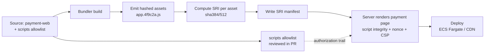
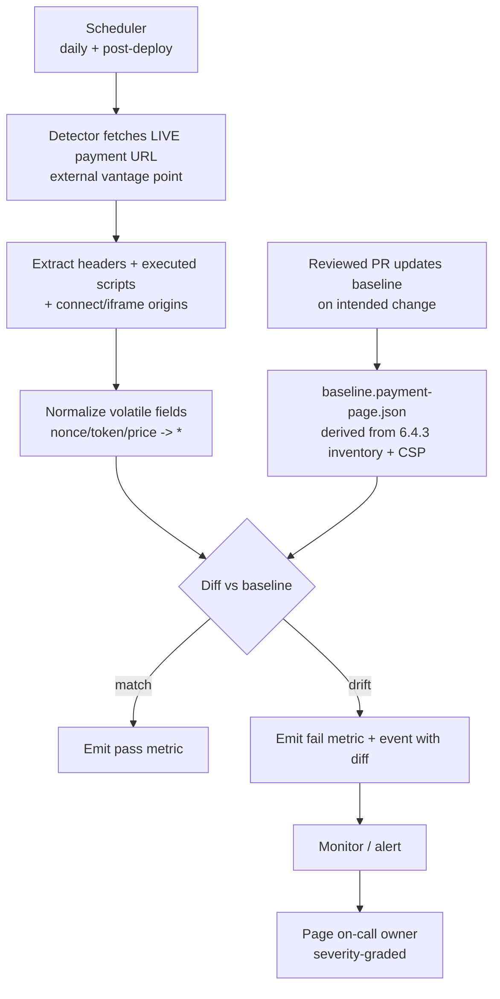
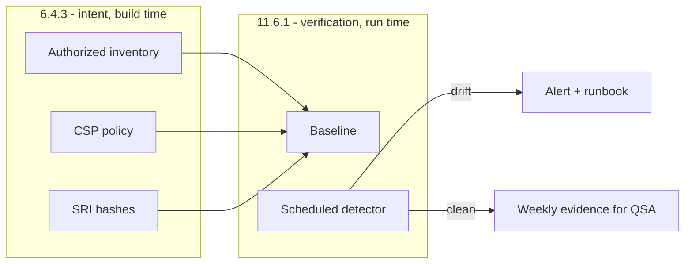

# Architecture and pipeline

How the build-time integrity controls (6.4.3) and the scheduled detection mechanism
(11.6.1) fit together. Diagrams are vendor-neutral; the notes in brackets show the
tooling used in the original engagement.

## Build time: producing an integrity-assured payment page (6.4.3)

The allowlist (authorization) and the SRI manifest (integrity) are both build artifacts
checked or generated in CI, so the rendered page cannot reference a script that was not
authorized and hashed.

## Run time: detecting drift on the live page (11.6.1)

[Scheduler: Azure DevOps pipeline + scheduled function. Metrics, events and monitors:
Datadog. Hosting and edge: AWS ECS Fargate, WAF, CloudFront-style CDN, CloudTrail for
audit. AppConfig for runtime flags.]

## How the two halves reinforce each other

The detector's clean runs double as the periodic evidence a QSA expects for 11.6.1, and the
baseline is generated from the same inventory and CSP that satisfy 6.4.3 - one source of
truth, two requirements covered.

## Design principles that kept it maintainable

- One repository holds the allowlist, the CSP, and the detection baseline. A change to any
  of them is one reviewed PR, which is also the authorization record.
- Everything that can be generated is generated (SRI hashes, inventory). Nothing
  security-relevant is hand-edited on a payment page.
- The detector observes the page from outside, the way a customer does, not from inside the
  build. Injection happens at the edge and in third-party tags, which an internal-only check
  never sees.
- Alerts carry the diff and are graded by severity, so responders act on signal, not noise.
- Report-only first, then enforce (for CSP); baseline-then-alert (for detection). Roll out
  controls without breaking checkout.
